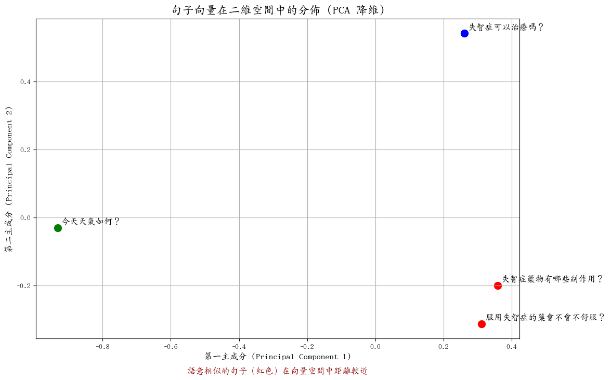

# 從零開始建立 RAG 系統：神經內科問答 Bot 教學

你好！這份文件將逐步帶你走過我們剛剛建立的這個專案 (`RAG-test`) 的完整流程。

我們的目標是建立一個專業領域的問答機器人。使用者問一個關於「失智症」的問題，系統能根據我們提供的衛教文章，生成一個準確且有來源的答案。

這整個技術的核心就叫做 **RAG (Retrieval-Augmented Generation)**。

## 觀念入門：什麼是 RAG？

想像一下，你是一個開卷考試的學生。

-   **傳統 LLM (像 ChatGPT)**：像是一個「閉卷考試」的學生。他腦中記了很多知識，但如果問他一個很新、或很專業的問題，他可能會答錯或亂掰。
-   **RAG 系統**：像是一個「開卷考試」的學生。當他拿到問題時，他會先去「翻書」（檢索資料庫），找到相關的段落，然後根據這些段落的內容來「組織答案」（生成回答）。

  
*(這張圖我稍後會產生)*

我們的 RAG 流程分為兩個階段：

1.  **資料準備 (Indexing)**：先把我們所有的衛教文章（書本）讀取、切塊、然後轉換成電腦看得懂的「向量」，存入一個專門的向量資料庫（書櫃）。這一步只需要做一次。
2.  **查詢 (Querying)**：當使用者提問時：
    a.  **檢索 (Retrieve)**：把問題也變成一個「向量」，然後去書櫃裡找語意最相近的幾個文本區塊。
    b.  **增強 (Augment)**：把原始問題和找到的文本區塊，一起打包成一個更豐富的 Prompt。
    c.  **生成 (Generate)**：把這個 Prompt 送給大型語言模型（LLM），讓他根據提供的上下文生成最終答案。

## 步驟一：專案結構與環境設定

一個好的專案結構能讓思路更清晰。我們的結構如下：

```
RAG-test/
├── data/
│   ├── raw/vghtpe/     # 原始衛教文章 .txt
│   └── vectordb/       # 存放轉換後的向量
├── docs/
│   └── tutorial.md     # 就是你正在看的這份文件
├── scripts/
│   ├── scrape_vghtpe.py # 爬蟲 (已完成)
│   └── test_rag.py      # 測試腳本
├── src/                  # 核心程式碼
│   ├── rag_engine/       # RAG 核心模組
│   │   ├── indexer.py    # 資料準備/索引
│   │   ├── retriever.py  # 檢索器
│   │   ├── generator.py  # 生成器
│   │   └── pipeline.py   # 整合所有流程
│   └── cli.py            # 命令列工具
├── .env.example          # 環境變數範本
├── pyproject.toml        # 專案依賴與設定
└── .gitignore            # Git 忽略清單
```

**環境設定**：

我們使用 `uv` 這個現代化的 Python 套件管理器，它非常快。

```bash
# 建立虛擬環境並安裝所有依賴
uv sync
```

這條指令會讀取 `pyproject.toml`，建立 `.venv` 虛擬環境，並把 `dependencies`（例如 `langchain`, `torch`）和 `dev-dependencies`（例如 `ruff`）都安裝好。

## 步驟二：資料準備 (Indexing) - `indexer.py`

這是 RAG 的基礎。我們需要把非結構化的文本（衛教文章 `*.txt`）變成結構化的、可被搜尋的資料。

### 1. 載入文件 (Loading)

我們使用 `DirectoryLoader` (來自 `langchain_community`) 來讀取 `data/raw/vghtpe/` 目錄下所有的 `.txt` 檔案。

```python
# in src/rag_engine/indexer.py
from langchain_community.document_loaders import DirectoryLoader

loader = DirectoryLoader(self.data_dir, glob="**/*.txt", show_progress=True)
documents = loader.load()
```

### 2. 文本分塊 (Splitting)

直接把整篇文章拿去分析效果不好。文章太長，資訊密度低。所以我們需要把長文切成一段一段有意義的小區塊 (chunks)。

我們使用 `RecursiveCharacterTextSplitter`，它會試著用不同的分隔符（如 `

`, `
`, ` `, ``）來切分，盡可能保持句子的完整性。

```python
# in src/rag_engine/indexer.py
from langchain.text_splitter import RecursiveCharacterTextSplitter

text_splitter = RecursiveCharacterTextSplitter(
    chunk_size=500,       # 每個區塊最多 500 字元
    chunk_overlap=50,     # 區塊之間重疊 50 字元 (避免語意被切斷)
    separators=["\n\n", "\n", " ", ""]
)
chunks = text_splitter.split_documents(documents)
```

`chunk_overlap` 很重要，它能確保上下文的連續性。例如，一句話剛好在 `chunk_size` 的邊界被切開，重疊的部分能讓下一塊補上這句話的開頭。

### 3. 嵌入 (Embedding) - 文字變向量！

這是 RAG 最神奇的地方。**Embedding** 是一個過程，它將一段文字轉換成一個由數字組成的向量 (vector)。這個向量可以被認為是該文字在多維空間中的「語意座標」。

-   **語意相近的文字，它們的向量在空間中的距離也比較近。**
-   **語意無關的文字，它們的向量在空間中的距離就比較遠。**

我們選用的模型是 `BAAI/bge-large-zh-v1.5`，這是一個對中文語意理解得很好的開源模型。

```python
# in src/rag_engine/indexer.py
from langchain_huggingface import HuggingFaceEmbeddings

self.embeddings = HuggingFaceEmbeddings(
    model_name="BAAI/bge-large-zh-v1.5",
    model_kwargs={"device": "cpu"}, # 如果有 GPU 可以改成 "cuda"
    encode_kwargs={"normalize_embeddings": True},
)
```

**深入理解：Tokenization**

在文字變成向量之前，模型會先進行「斷詞」(Tokenization)。簡單來說，就是把一個長句子切成模型看得懂的一個個最小單位 (Token)。

對於 `bge-large-zh-v1.5` 這類中文模型，一個 Token 通常就是一個中文字。對於英文，則可能是一個單字或一個子詞 (subword)。

你可以透過以下腳本親眼看看這個過程：

```python
# scripts/show_tokens.py
from transformers import AutoTokenizer

# 載入與我們 Embedding 模型完全相同的 Tokenizer
tokenizer = AutoTokenizer.from_pretrained("BAAI/bge-large-zh-v1.5")

sentence = "失智症可以治療嗎？"
tokens = tokenizer.tokenize(sentence)

print(f"原始句子: {sentence}")
print(f"Tokens: {tokens}")

# Tokenizer 還會將 token 轉為數字 ID
token_ids = tokenizer.convert_tokens_to_ids(tokens)
print(f"Token IDs: {token_ids}")
```

執行 `uv run python scripts/show_tokens.py`，你會看到：
```
原始句子: 失智症可以治療嗎？
Tokens: ['失', '智', '症', '可', '以', '治', '療', '嗎', '？']
Token IDs: [290失, 2577智, 452症, 叮可, 872以, 363治, 386療, 1018嗎, 8043？]
```
模型實際上處理的是這些 `Token IDs`。`Embedding` 層會為每個 ID 查找對應的初始向量，然後再透過模型（如 Transformer）的計算，得出整個句子的語意向量。

### 4. 存入向量資料庫 (Vector Store)

我們有了大量的文本區塊向量，需要一個地方來高效地儲存和搜尋它們。這就是向量資料庫的作用。我們使用 `Chroma`，它是一個輕量級、可本地儲存的向量資料庫。

```python
# in src/rag_engine/indexer.py
from langchain_chroma import Chroma

self.vectorstore = Chroma.from_documents(
    documents=chunks,
    embedding=self.embeddings,
    persist_directory=str(self.persist_directory),
)
```

這行程式碼會遍歷所有 `chunks`，用 `self.embeddings` 模型計算每個 chunk 的向量，然後把它們連同原文一起存進 `data/vectordb/` 目錄。

## 步驟三：檢索與生成 (Query Time) - `pipeline.py`

當使用者輸入問題時，真正的 RAG 流程就開始了。

### 1. 檢索 (Retrieve) - `retriever.py`

首先，我們用**同樣的 Embedding 模型**將使用者的問題轉換成一個向量。

```python
question = "失智症可以治療嗎？"
question_vector = embedding_model.embed_query(question)
```

然後，我們拿這個 `question_vector` 去向量資料庫 `Chroma` 裡做「相似度搜尋」。Chroma 會回傳資料庫裡跟問題向量「距離最近」的 K 個文本區塊。這就是我們的「參考資料」。

```python
# in src/rag_engine/retriever.py
class DocumentRetriever:
    def __init__(self, vectorstore, top_k=5):
        self.retriever = vectorstore.as_retriever(search_kwargs={"k": top_k})

    def retrieve(self, query: str) -> list[str]:
        docs = self.retriever.invoke(query)
        return [doc.page_content for doc in docs]
```

**向量空間視覺化**

想像一個二維空間。兩個相似的問題，如：
1.  `"失智症藥物有哪些副作用？"`
2.  `"服用失智症的藥會不會不舒服？"`

它們的向量會落在很近的位置。而一個不相關的問題，如 `"今天天氣如何？"`，它的向量就會在很遠的地方。我們用 `scripts/visualize_embeddings.py` 產生了下面這張圖，它清楚地展示了這個概念。



### 2. 生成 (Generate) - `generator.py`

現在我們有了：
1.  **原始問題** (`query`)
2.  **相關的文本區塊** (`context_docs`)

接下來，我們把它們組合起來，餵給一個大型語言模型 (LLM)，如 OpenAI 的 `gpt-4o-mini`。

我們會設計一個 **Prompt Template**，告訴 LLM 它的角色和任務：

```python
# in src/rag_engine/generator.py
prompt_template = """
你是一個專業且嚴謹的醫療問答助理。
請根據下方提供的「參考資料」，簡潔地回答「問題」。
如果參考資料沒有提到，請回答「根據我所擁有的資料，我無法回答這個問題。」，絕對不可以憑空捏造。

[參考資料]
{context}

[問題]
{question}

[回答]
"""
```

這個 template 非常重要。它透過指令 (`你是一個...`) 和範例 (`[參考資料]...`) 來約束 LLM 的行為，讓它只根據我們提供的資料來回答，這大大降低了「幻覺」(Hallucination) 的風險。

最後，我們用 LangChain 把所有東西串起來，呼叫 LLM API，得到最終答案。

```python
# in src/rag_engine/generator.py
from langchain_openai import ChatOpenAI
from langchain.prompts import PromptTemplate
from langchain_core.output_parsers import StrOutputParser

# ...
chain = (
    {"context": retriever.retrieve, "question": RunnablePassthrough()}
    | PromptTemplate(template=prompt_template)
    | self.llm
    | StrOutputParser()
)
answer = chain.invoke(query)
```

## 總結

這個專案完整地展示了 RAG 的核心思想：**檢索 + 生成**。

-   **檢索** 確保了答案的「事實基礎」，所有回答都來自於我們信任的衛教文件。
-   **生成** 則利用 LLM 強大的語言能力，將生硬的資料轉化為通順、易懂的自然語言。

希望這份教學對你有幫助！接下來，我會把上面提到的視覺化範例補上。
